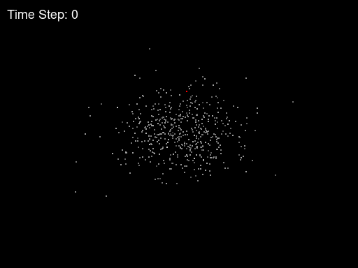

# N-body simulation


An N-body simulation is a type of computational simulation used to study the motion and interaction of a large number of objects (referred to as bodies) in a three-dimensional space.

In this simulation, each body is treated as a particle that interacts with other bodies through gravitational force (or other forces, depending on the context). The main objective is to compute the positions and velocities of all bodies as a function of time, taking into account the mutual attractive forces.

N-body simulation is often used in various scientific fields such as astronomy, particle physics, computational biology, and fluid dynamics. It can be used to model astronomical systems such as galaxies, solar systems, or stellar clusters, or to study more complex phenomena such as galaxy formation or protein interactions.

From a computational perspective, the simulation can require significant computational effort when many bodies are involved because they need to interact with all the other bodies present in the system.

We present the solution to the problem using two types of algorithms.
The first one, called exhaustive, computes the positions at time t+1 by calculating the interaction of each individual body with all others present in the system with time complexity $O(n^2)$.

The second algorithm... continue...

## Source code
In the __serial__ folder, you will find the implementations of the two algorithms in a serial manner.

In the __openmp__ folder, you will find the parallelized versions using the OpenMP library.

In the __cuda__ folder, you will find the versions optimized for Nvidia GPUs.

In the __utils__ folder, you will find supporting Python codes such as the one for visualizing the computation results through video.

### Compiling
The _Makefile_ contains all the targets for compiling all the source code.

### Run The Code
Exhaustive serial
```shell
$ exh_serial input_filename start_time end_time delta_time output_filename
```

Exhaustive serial
```shell
$ exh_mp input_filename start_time end_time delta_time output_filename THREADS_NUM
```

Exhaustive CUDA
```shell
$ exh_cuda input_filename start_time end_time delta_time output_filename grid_size block_size
```

BarnesHut serial
```shell
$ barnes-hut input_filename start_time end_time delta_time output_filename
```

BarnesHut OpenMP
```shell
$ barnes-hut-omp input_filename start_time end_time delta_time output_filename THREADS_NUM
```

BarnesHut CUDA
```shell
$ barnes-hut-cuda input_filename start_time end_time delta_time output_filename [cache_sz_MB]
```

### Code Formatting
[Clang-format](https://clang.llvm.org/docs/ClangFormat.html) for c code (rules are in the root).\
[Black](https://github.com/psf/black) for python code.

## Video
To display the output of a result graphically, you can use the command
```sh
make play FILE=<file name>
```
or
```sh
python utils/pygame-show.py <file name>
```

## Perfomance analisys
...
