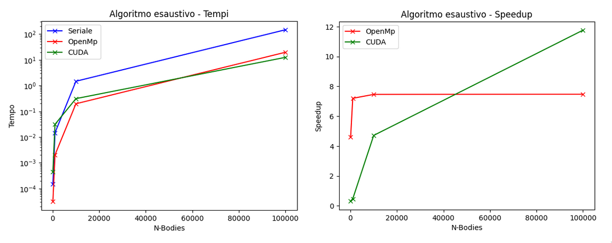
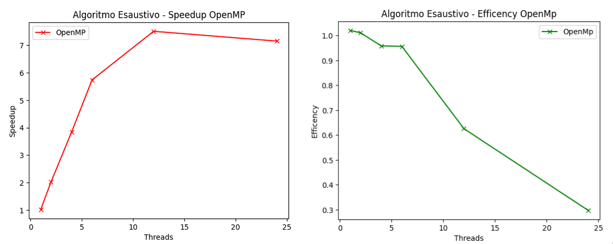
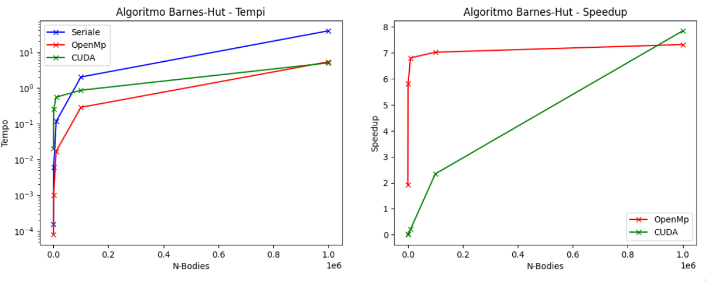
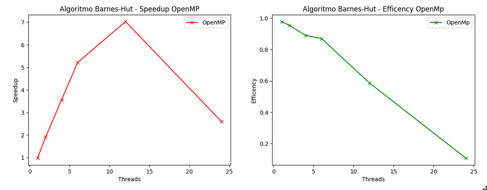

# N-body simulation

<figure align="center">
  
  <figcaption align = "center">The red dot is just to have a reference point.</figcaption>
</figure>


An N-body simulation is a type of computational simulation used to study the motion and interaction of a large number of objects (referred to as bodies) in a three-dimensional space.

In this simulation, each body is treated as a particle that interacts with other bodies through gravitational force (or other forces, depending on the context). The main objective is to compute the positions and velocities of all bodies as a function of time, taking into account the mutual attractive forces.

N-body simulation is often used in various scientific fields such as astronomy, particle physics, computational biology, and fluid dynamics. It can be used to model astronomical systems such as galaxies, solar systems, or stellar clusters, or to study more complex phenomena such as galaxy formation or protein interactions.

From a computational perspective, the simulation can require significant computational effort when many bodies are involved because they need to interact with all the other bodies present in the system.

We present the solution to the problem using two types of algorithms.
The first one, called exhaustive, computes the positions at time t+1 by calculating the interaction of each individual body with all others present in the system with time complexity $O(n^2)$.

The second one, the Barnes-Hut algorithm, uses a tree data structure called a quadtree or octree depending on the number of children each node can have. With a quadtree, we can represent a two-dimensional space, while with an octree, a three-dimensional space.
Each node of the tree represents a region of space and internally contains information about the bodies present in its subtree.<br>
This algorithm has a known computational cost of $O(nlogn)$, which is lower than the exhaustive approach because during the calculation of interactions between bodies, those that are far away can be considered as a single, larger body, significantly reducing the number of calculations to be performed. The choice to make this approximation is determined by comparing it with a parameter THETA, which indicates whether the distance between the node containing the bodies is sufficient for approximation or if further refinement is necessary.

<p align="center">
  
</p>


## Source code
In the __serial__ folder, you will find the implementations of the two algorithms in a serial manner.

In the __openmp__ folder, you will find the parallelized versions using the OpenMP library.

In the __cuda__ folder, you will find the versions optimized for Nvidia GPUs.

In the __utils__ folder, you will find supporting Python codes such as the one for visualizing the computation results through video.

### Compiling
The _Makefile_ contains all the targets for compiling all the source code.

### Run The Code
Exhaustive serial
```shell
$ exh_serial input_filename start_time end_time delta_time output_filename
```

Exhaustive serial
```shell
$ exh_mp input_filename start_time end_time delta_time output_filename THREADS_NUM
```

Exhaustive CUDA
```shell
$ exh_cuda input_filename start_time end_time delta_time output_filename grid_size block_size
```

BarnesHut serial
```shell
$ barnes-hut input_filename start_time end_time delta_time output_filename
```

BarnesHut OpenMP
```shell
$ barnes-hut-omp input_filename start_time end_time delta_time output_filename THREADS_NUM
```

BarnesHut CUDA
```shell
$ barnes-hut-cuda input_filename start_time end_time delta_time output_filename [cache_sz_MB]
```

## Video
To display the output of a result graphically, you can use the command
```sh
make play FILE=<file name>
```
or
```sh
python utils/pygame-show.py <file name>
```

## Perfomance analisys

Exhaustive time/speedup plots with 100, 1k, 10k, 100k bodies.
<p align="center">
  
</p>

Exhaustive speedup/efficency 10k bodies test with 1, 2, 4, 6, 12, 24 threads on Core i5-11600K.
<p align="center">
  
</p>

Barnes-hut time/speedup plots with 100, 1k, 10k, 100k, 1M bodies.
<p align="center">
  
</p>

Barnes-hut speedup/efficency 10k bodies test with 1, 2, 4, 6, 12, 24 threads on Core i5-11600K.
<p align="center">
  
</p>

